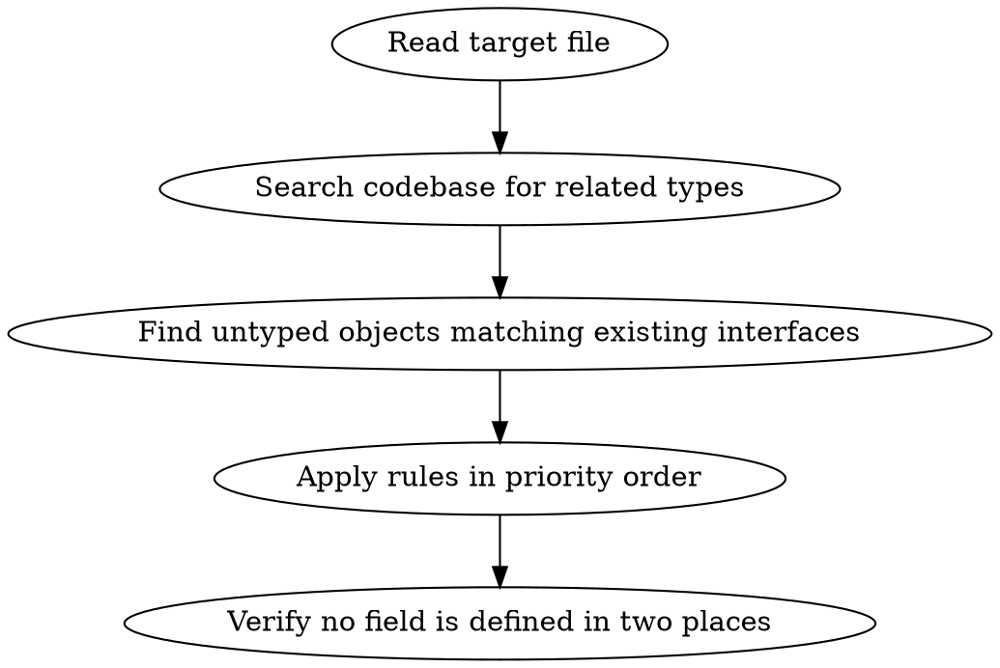

# Type Cleanup

Rewrite TypeScript types so every field has a single source of truth, every domain parameter is typed against a real interface, and nested shapes are extracted for reuse.

## Workflow



**Before touching any type**, search the codebase for existing interfaces the target types could derive from. Use `Grep` to find `interface` and `type` declarations in the project that share field names with the types you are cleaning up.

**Then**, search for untyped object literals, variables, and parameters whose fields overlap with known interfaces. If an object has 2+ fields matching an interface, it should be typed against it.

## Rules (in priority order)

### 1. Type store writes — highest priority

Functions that write to external stores (Firestore, Redis, Postgres, any DB) **must** have parameters typed against existing interfaces. The store accepts any shape at runtime — TypeScript is the only defense against wrong field names.

```typescript
// ❌ Store accepts anything — typos are silent runtime bugs
async function updateUser(id: string, data: Record<string, unknown>): Promise<void>
async function createUser(data: Record<string, any>): Promise<string>

// ✅ Typed against the domain interface
async function updateUser(id: string, data: Partial<Pick<User, "displayName" | "email" | "role">>): Promise<void>
async function createUser(data: Omit<User, "id" | "createdAt" | "updatedAt">): Promise<string>
```

`Record<string, unknown>` is **not** an acceptable middle ground — it still silently accepts wrong keys.

### 2. Single source of truth — derive, don't duplicate

Never manually redefine fields that exist on another interface. Use `Partial`, `Pick`, `Omit`, `extends`, or intersection (`&`) to derive.

```typescript
// ❌ Duplicates id, email, displayName from User
interface BillingUser {
  id: string; email: string; displayName: string;
  plan: BillingPlan; stripeCustomerId: string;
}

// ✅ Derives shared fields
interface BillingUser extends Pick<User, "id" | "email" | "displayName"> {
  plan: BillingPlan;
  stripeCustomerId: string;
}
```

**Test**: if changing a field type on the source interface should also change it on the derived type, they must be linked — not copy-pasted.

#### Prefer `Pick` over indexed access types

When extracting a field's type, use `Pick` so the relationship to the source interface is explicit and the field name is checked at compile time. Indexed access (`Interface["field"]`) hides the structural relationship and is harder to trace.

```typescript
// ❌ Indexed access — relationship to source interface is hidden
interface CheckoutForm {
  plan: NonNullable<UserSubscription["plan"]>;
}

// ✅ Pick — compiler verifies the field exists and relationship is explicit
interface CheckoutForm extends Pick<UserSubscription, "plan"> {
  // If UserSubscription["plan"] becomes non-nullable, this stays in sync automatically
}
```

If the source field is nullable but the derived context requires a non-null value, prefer narrowing at the call site rather than `NonNullable` in the type definition — the nullability exists on the source for a reason.

### 3. Extract named interfaces for nested objects

Inline object types inside interfaces cannot be reused or referenced independently. Extract them.

```typescript
// ❌ Nested inline — can't reuse, drifts from other definitions
interface UserWithSubscription {
  subscription: { plan: string; status: string; currentPeriodEnd: Date };
}

// ✅ Extracted — reusable as building block
interface Subscription {
  plan: BillingPlan;
  status: SubscriptionStatus;
  currentPeriodEnd: Date;
  cancelAtPeriodEnd: boolean;
}
interface UserWithSubscription extends User {
  subscription: Subscription;
  company: Company;
}
```

### 4. Never use `Record<string, unknown>` or `any` for domain parameters

If a function accepts a domain object, type it against the domain interface. This catches typos at compile time.

Applies to all function signatures, not just store writes.

### 5. Convert string unions to const arrays

String union types exist only at compile time. Extract them to `as const` arrays so values are available at runtime (validation, iteration, dropdowns) while preserving the same type.

```typescript
// ❌ Values not accessible at runtime
type Status = "active" | "inactive" | "pending"

// ✅ Values available at runtime and compile time
const STATUS = ["active", "inactive", "pending"] as const
type Status = (typeof STATUS)[number]
```

**Naming convention**: array is `UPPER_SNAKE` (it's a constant), type keeps its original `PascalCase` name.

### 6. Type-safe untyped objects that match existing interfaces

Search for object literals, variables, and function parameters that aren't typed but whose fields overlap with a known interface. If 2+ fields match, apply the type.

```typescript
// ❌ Untyped object — typos and wrong value types are silent
const newUser = { name: "Alice", company: "Acme", age: 30 }
await db.collection("users").add(newUser)

// ✅ Typed against existing interface — compiler catches mistakes
const newUser: Omit<User, "id" | "createdAt"> = { name: "Alice", company: "Acme", age: 30 }
await db.collection("users").add(newUser)
```

**How to find candidates**: after identifying interfaces in the target file, `Grep` for their field names across the codebase. Look for object literals `{ fieldA, fieldB }` and destructured parameters `({ fieldA, fieldB })` that aren't typed.

### 7. Search for inheritance candidates

Before writing a new interface or cleaning up an existing one, **actively search** the codebase:

```
Grep for: "interface.*{field_name}" or "type.*{field_name}"
```

If an existing interface already defines the fields you need, derive from it instead of defining new fields.

## Common Mistakes

| Mistake | Fix |
|---------|-----|
| Upgrading `any` to `Record<string, unknown>` and stopping | Use actual domain types — `unknown` still accepts wrong keys |
| Creating a new `Base` interface when one already exists | Search first — `Pick<ExistingInterface, ...>` is better |
| Rating store-write typing as low priority | It's highest priority — runtime stores have zero type checking |
| Extracting nested types but not linking them back | Extracted type must be used in the parent via `extends` or composition |
| Leaving object literals untyped when a matching interface exists | Grep for field names — if 2+ fields match an interface, type it |
| Using `NonNullable<Interface["field"]>` to extract a field type | Use `extends Pick<Interface, "field">` — keeps the structural link explicit |
